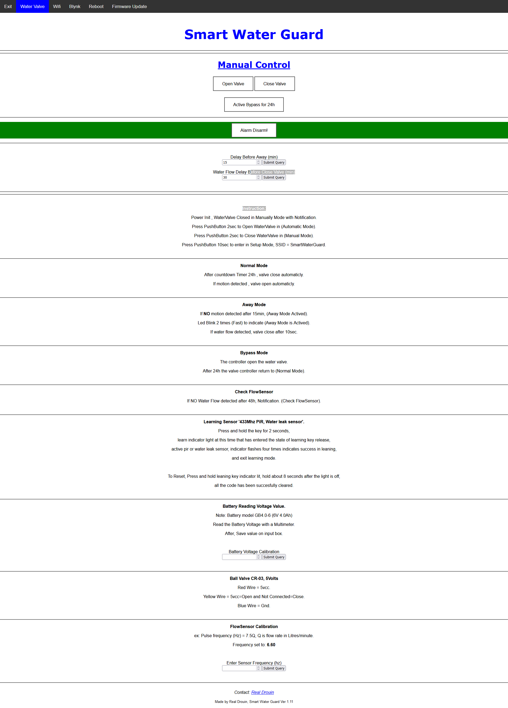

# WaterGuard
# ----------
# on board webPage

# on board webPage

# on board webPage

# on board webPage

# API

# Blynk

# Blynk

# Blynk

# Node-Red

# Node-Red

# Schematic

# ******** RXC6 RF receiver 433 Mhz - 4 Channel **********

Super Heterodyne recepteur avec decodeur, type d'apprentissage.

decodage PT2262, PT2260, PT2240, EV1527 et d'autres d'apprentissage

codeto puce ou compatible puces, peut apprendre et magasin 30 pcs de code

different telecommande.intelligemment distinguer resistance aux chocs entre

code fixe et l'apprentissage code, comme PT2262 et EV1527.

Quick Specs

Frequency: 433.92Mhz

****Operating Voltage: 3 to 5.5V DC

Quiescunt Current: 4ma

Receiver sensitivity: -105DB

Size 30 * 14 * 7mm

External antenna: 32cm single core wire, wound into a spiral

PIN ASSIGMENT

1 = ANT - External Antenna - Spiral 32cm

2 = GND - Ground (no pin installed)

3 = External Led +.6v (no pin installed)

4 = External Switch to GND for programming mode (Pairing) (no pin installed)

5 = VT: Will Flash when signal receive

6 = Data D0

7 = Data D1

8 = Data D2

9 = Data D3

10 = Vcc (Push Button, Cristal)

11 = GND (Push Button, Cristal)

**** Learn button ****

Press and hold the key for 2 seconds,

learn indicator light at this time that has entered the state of learning key release,

press any remote control - a key indicator flashes four times indicates success in leaning,

and exit learning mode.

To Reset, Press and hold leaning key indicator lit, hold about 8 seconds after the light is off,

all the code has been succesfully cleared.

When PIR actived , Pin VT = High.

WaterLeak Sensor , Pin D0 (ch4) = High.

